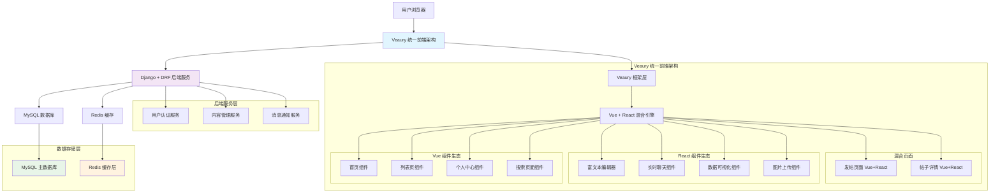
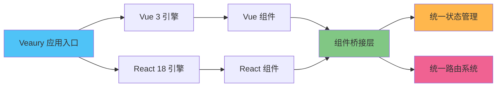
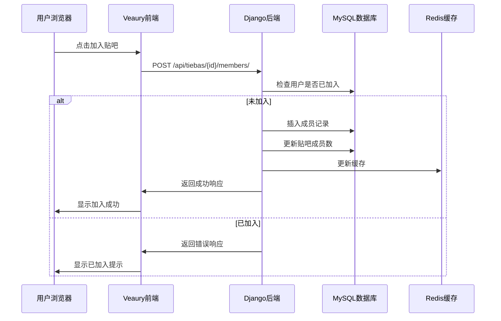
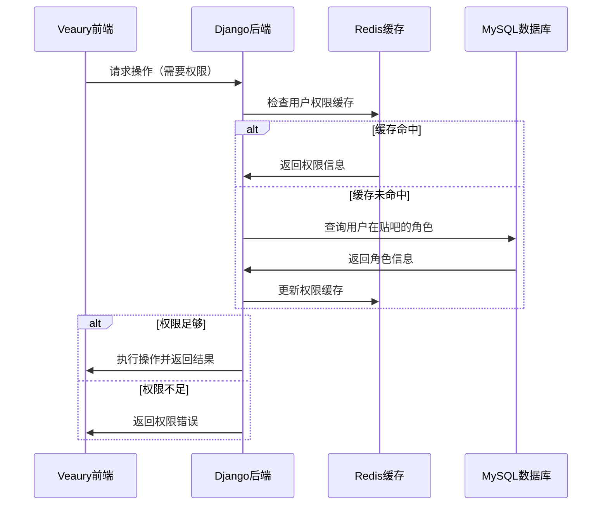

# 百度贴吧项目技术架构补充文档

## 1. 系统架构图（修复版）

### 1.1 完整系统架构



### 1.2 Veaury 框架层详细架构



## 2. 数据库表结构（完整版）

### 2.1 贴吧成员表 (tieba_members)

```sql
-- 贴吧成员表
CREATE TABLE tieba_members (
    id BIGINT PRIMARY KEY AUTO_INCREMENT COMMENT '主键ID',
    user_id BIGINT NOT NULL COMMENT '用户ID',
    tieba_id BIGINT NOT NULL COMMENT '贴吧ID',
    role ENUM('member', 'moderator', 'admin') DEFAULT 'member' COMMENT '角色',
    joined_at TIMESTAMP DEFAULT CURRENT_TIMESTAMP COMMENT '加入时间',
    status TINYINT DEFAULT 1 COMMENT '状态：1-正常，0-禁用',
    created_at TIMESTAMP DEFAULT CURRENT_TIMESTAMP COMMENT '创建时间',
    updated_at TIMESTAMP DEFAULT CURRENT_TIMESTAMP ON UPDATE CURRENT_TIMESTAMP COMMENT '更新时间',
    
    -- 外键约束
    FOREIGN KEY (user_id) REFERENCES users(id) ON DELETE CASCADE,
    FOREIGN KEY (tieba_id) REFERENCES tiebas(id) ON DELETE CASCADE,
    
    -- 唯一约束
    UNIQUE KEY uk_user_tieba (user_id, tieba_id),
    
    -- 索引
    INDEX idx_user_id (user_id),
    INDEX idx_tieba_id (tieba_id),
    INDEX idx_role (role),
    INDEX idx_status (status),
    INDEX idx_joined_at (joined_at)
) ENGINE=InnoDB DEFAULT CHARSET=utf8mb4 COMMENT='贴吧成员表';
```

### 2.2 相关表结构补充

#### 用户表 (users)
```sql
CREATE TABLE users (
    id BIGINT PRIMARY KEY AUTO_INCREMENT COMMENT '用户ID',
    username VARCHAR(50) UNIQUE NOT NULL COMMENT '用户名',
    email VARCHAR(100) UNIQUE COMMENT '邮箱',
    phone VARCHAR(20) UNIQUE COMMENT '手机号',
    password_hash VARCHAR(255) NOT NULL COMMENT '密码哈希',
    avatar VARCHAR(255) COMMENT '头像URL',
    nickname VARCHAR(50) COMMENT '昵称',
    gender TINYINT DEFAULT 0 COMMENT '性别：0-未知，1-男，2-女',
    birthday DATE COMMENT '生日',
    signature TEXT COMMENT '个人签名',
    status TINYINT DEFAULT 1 COMMENT '状态：1-正常，0-禁用',
    last_login_at TIMESTAMP COMMENT '最后登录时间',
    created_at TIMESTAMP DEFAULT CURRENT_TIMESTAMP COMMENT '创建时间',
    updated_at TIMESTAMP DEFAULT CURRENT_TIMESTAMP ON UPDATE CURRENT_TIMESTAMP COMMENT '更新时间',
    
    INDEX idx_username (username),
    INDEX idx_email (email),
    INDEX idx_phone (phone),
    INDEX idx_status (status),
    INDEX idx_created_at (created_at)
) ENGINE=InnoDB DEFAULT CHARSET=utf8mb4 COMMENT='用户表';
```

#### 贴吧表 (tiebas)
```sql
CREATE TABLE tiebas (
    id BIGINT PRIMARY KEY AUTO_INCREMENT COMMENT '贴吧ID',
    name VARCHAR(100) UNIQUE NOT NULL COMMENT '贴吧名称',
    description TEXT COMMENT '贴吧描述',
    avatar VARCHAR(255) COMMENT '贴吧头像',
    cover VARCHAR(255) COMMENT '贴吧封面',
    owner_id BIGINT NOT NULL COMMENT '创建者ID',
    category_id INT COMMENT '分类ID',
    member_count INT DEFAULT 0 COMMENT '成员数量',
    post_count INT DEFAULT 0 COMMENT '帖子数量',
    is_public TINYINT DEFAULT 1 COMMENT '是否公开：1-公开，0-私有',
    status TINYINT DEFAULT 1 COMMENT '状态：1-正常，0-禁用',
    created_at TIMESTAMP DEFAULT CURRENT_TIMESTAMP COMMENT '创建时间',
    updated_at TIMESTAMP DEFAULT CURRENT_TIMESTAMP ON UPDATE CURRENT_TIMESTAMP COMMENT '更新时间',
    
    FOREIGN KEY (owner_id) REFERENCES users(id) ON DELETE RESTRICT,
    
    INDEX idx_name (name),
    INDEX idx_owner_id (owner_id),
    INDEX idx_category_id (category_id),
    INDEX idx_status (status),
    INDEX idx_is_public (is_public),
    INDEX idx_member_count (member_count),
    INDEX idx_created_at (created_at)
) ENGINE=InnoDB DEFAULT CHARSET=utf8mb4 COMMENT='贴吧表';
```

## 3. API 接口设计

### 3.1 贴吧成员管理接口

#### 加入贴吧
```
POST /api/tiebas/{tieba_id}/members/
```

**请求参数：**
```json
{
    "user_id": 123
}
```

**响应数据：**
```json
{
    "code": 200,
    "message": "加入成功",
    "data": {
        "id": 1,
        "user_id": 123,
        "tieba_id": 456,
        "role": "member",
        "joined_at": "2024-01-01T10:00:00Z"
    }
}
```

#### 获取贴吧成员列表
```
GET /api/tiebas/{tieba_id}/members/
```

**查询参数：**
- `page`: 页码（默认1）
- `page_size`: 每页数量（默认20）
- `role`: 角色筛选（可选）

**响应数据：**
```json
{
    "code": 200,
    "message": "获取成功",
    "data": {
        "total": 100,
        "page": 1,
        "page_size": 20,
        "results": [
            {
                "id": 1,
                "user": {
                    "id": 123,
                    "username": "user123",
                    "nickname": "用户123",
                    "avatar": "avatar_url"
                },
                "role": "member",
                "joined_at": "2024-01-01T10:00:00Z"
            }
        ]
    }
}
```

### 3.2 权限管理接口

#### 设置成员角色
```
PUT /api/tiebas/{tieba_id}/members/{member_id}/role/
```

**请求参数：**
```json
{
    "role": "moderator"
}
```

## 4. 前后端数据交互流程

### 4.1 用户加入贴吧流程



### 4.2 贴吧成员权限验证流程



## 5. 性能优化策略

### 5.1 数据库优化
- **索引优化**：为常用查询字段添加复合索引
- **分页查询**：使用 LIMIT 和 OFFSET 进行分页
- **读写分离**：主库写入，从库读取

### 5.2 缓存策略
- **用户权限缓存**：Redis 存储用户在各贴吧的角色信息
- **成员列表缓存**：缓存热门贴吧的成员列表
- **计数器缓存**：贴吧成员数量等统计信息

### 5.3 前端优化
- **组件懒加载**：按需加载 Vue 和 React 组件
- **数据预取**：提前加载用户可能访问的数据
- **虚拟滚动**：大列表使用虚拟滚动技术

## 6. 安全考虑

### 6.1 权限控制
- **角色验证**：每个操作都需要验证用户角色
- **操作日志**：记录敏感操作的日志
- **频率限制**：防止恶意操作和刷屏

### 6.2 数据安全
- **SQL注入防护**：使用参数化查询
- **XSS防护**：前端输入过滤和转义
- **CSRF防护**：使用 CSRF Token

## 7. 监控和日志

### 7.1 性能监控
- **响应时间监控**：API 接口响应时间
- **数据库性能**：慢查询监控
- **缓存命中率**：Redis 缓存效果监控

### 7.2 业务监控
- **用户行为**：加入贴吧、发帖等关键行为
- **异常监控**：错误率和异常类型统计
- **资源使用**：服务器资源使用情况

---

**文档版本**: v1.0  
**最后更新**: 2024年1月  
**维护人员**: 开发团队