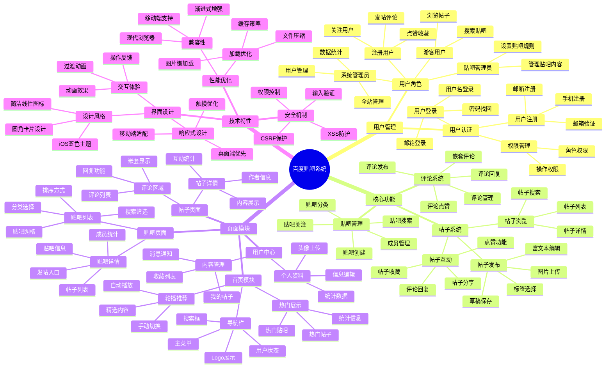
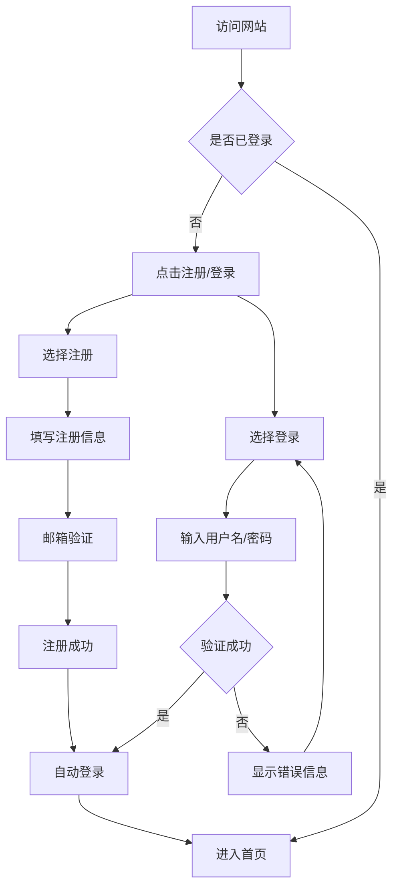
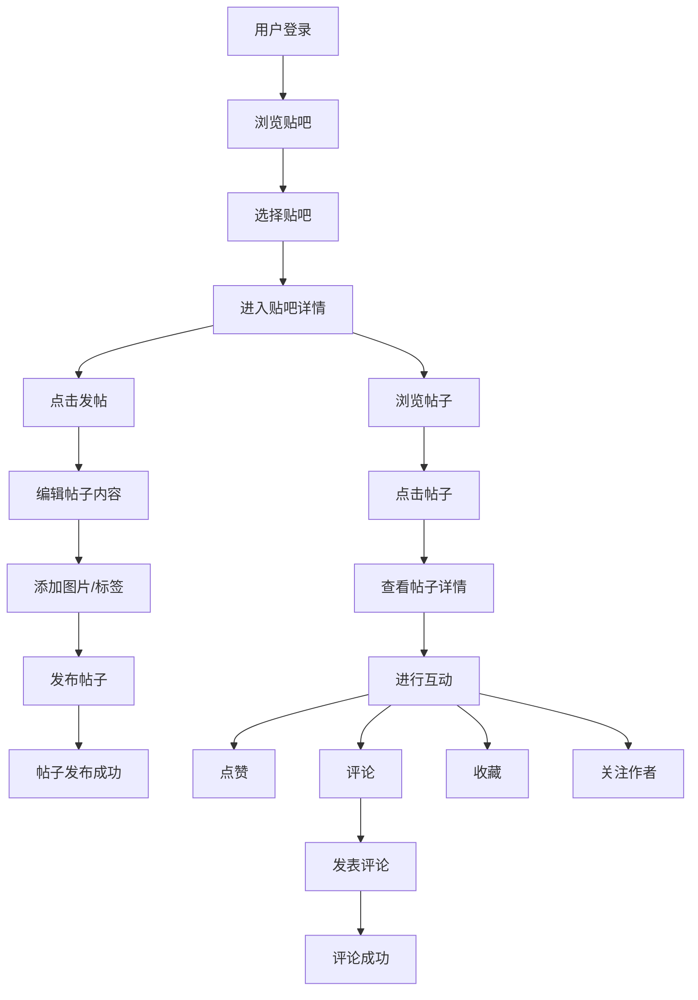
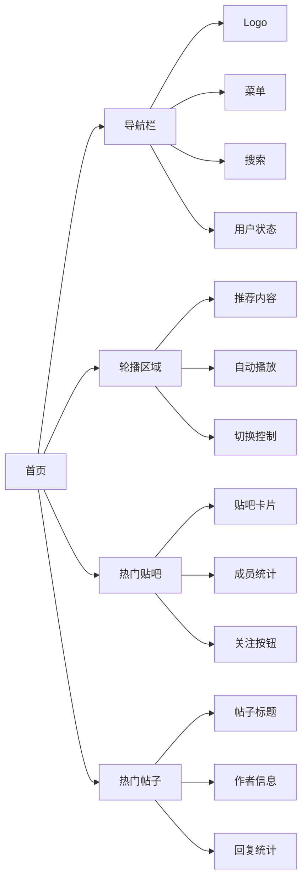
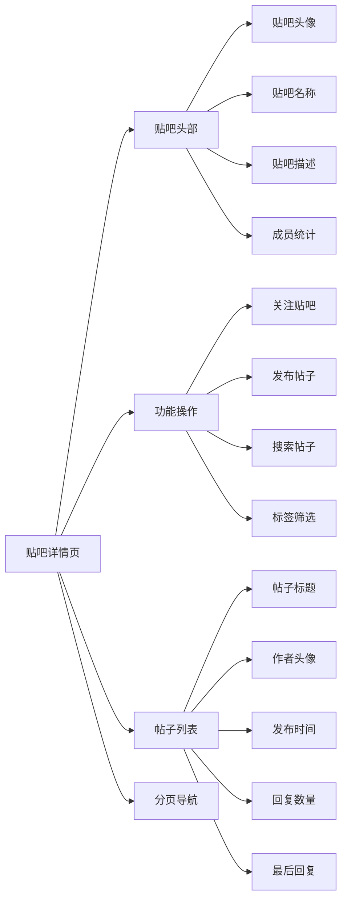
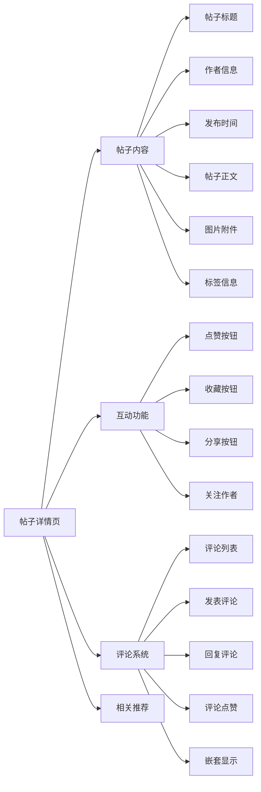
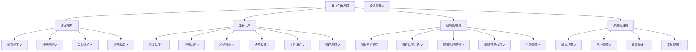
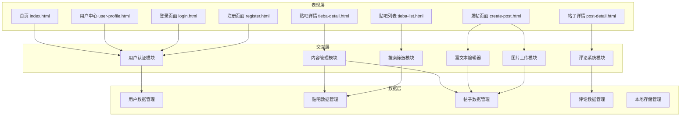

# 百度贴吧功能思维导图

## 功能架构思维导图

## 核心功能流程图

### 用户注册登录流程

### 发帖互动流程

## 页面功能分解

### 首页功能模块

### 贴吧详情功能模块

### 帖子详情功能模块

## 用户角色权限矩阵

## 技术架构功能分层

---

*本思维导图基于百度贴吧项目需求分析文档生成，涵盖了系统的核心功能、页面模块、用户角色、技术特性等各个方面，为项目开发提供清晰的功能架构指导。*