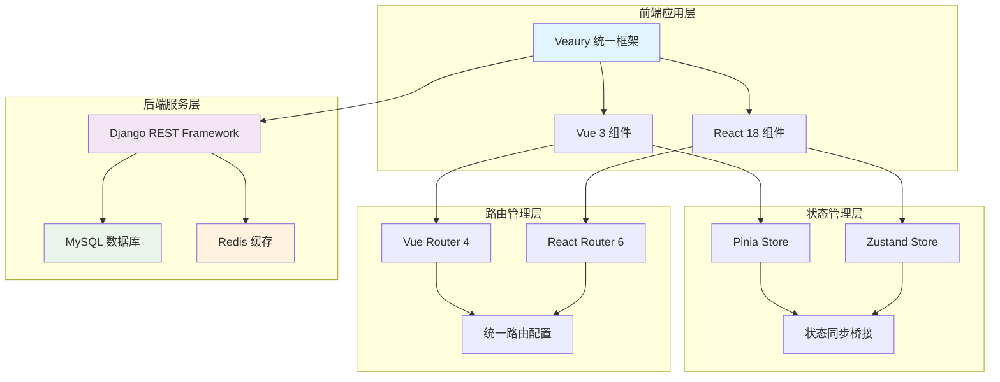
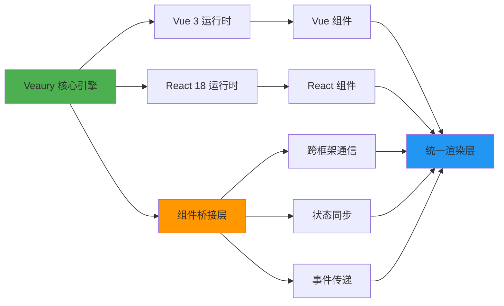
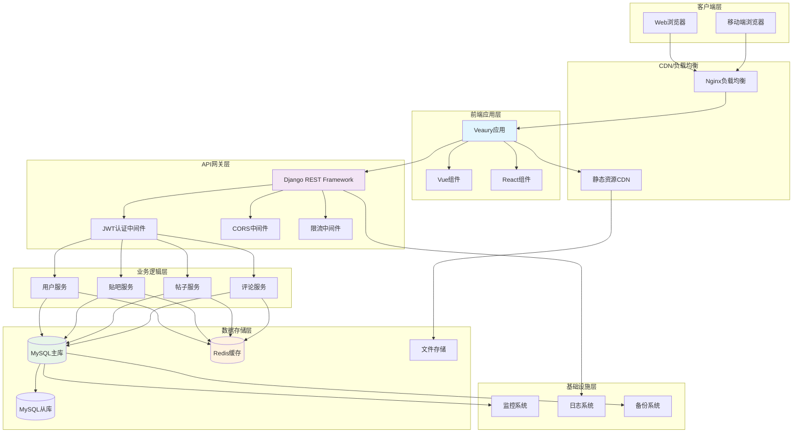
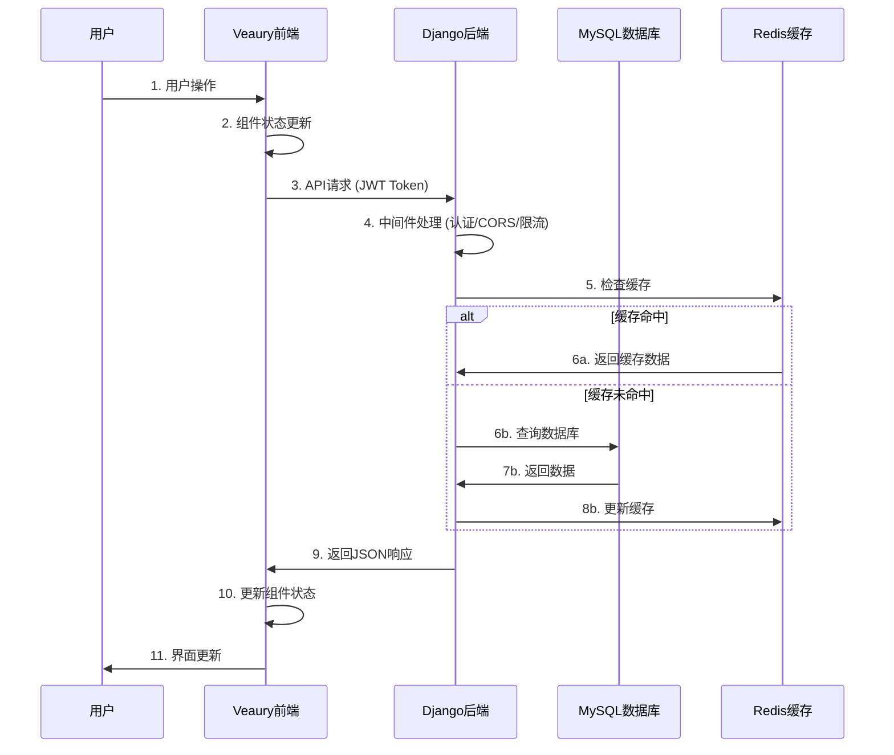

# 百度贴吧项目技术架构文档

## 1. Veaury框架技术架构设计

### 1.1 整体架构图



### 1.2 Veaury 混合引擎架构



## 2. 技术栈描述

* **前端框架**: Veaury (Vue 3 + React 18 混合框架)

* **构建工具**: Vite 4.x + TypeScript 5.x

* **状态管理**: Pinia (Vue) + Zustand (React)

* **路由管理**: Vue Router 4.x + React Router 6.x (统一管理)

* **UI组件库**: Element Plus (Vue) + Ant Design (React)

* **样式方案**: Tailwind CSS 3.x + CSS Modules

* **后端框架**: Django 4.x + Django REST Framework

* **数据库**: MySQL 8.0 + Redis 7.x

* **认证系统**: JWT Token + Django Authentication

* **文件存储**: 本地存储 + 阿里云OSS

* **测试框架**: Vitest + Vue Test Utils + React Testing Library

## 3. 路由定义

| 路由            | 组件类型      | 主要技术                    | 用途                       |
| ------------- | --------- | ----------------------- | ------------------------ |
| /             | Vue       | Vue 3 + Composition API | 首页，展示热门贴吧和帖子推荐           |
| /tieba-list   | Vue       | Vue 3 + Element Plus    | 贴吧列表页，浏览和搜索贴吧            |
| /tieba/:id    | Vue       | Vue 3 + 动态路由            | 贴吧详情页，查看贴吧内帖子列表          |
| /post/:id     | Vue+React | 混合组件                    | 帖子详情页，阅读帖子内容和评论          |
| /create-post  | Vue+React | 混合组件                    | 发帖页面，Vue表单 + React富文本编辑器 |
| /user-profile | Vue       | Vue 3 + Pinia           | 用户中心，管理个人信息和内容           |
| /login        | Vue       | Vue 3 + 表单验证            | 登录页面，用户身份验证              |
| /register     | Vue       | Vue 3 + 表单验证            | 注册页面，新用户注册               |

## 4. 前端开发规范与标准

### 4.1 Veaury 项目结构标准

```
src/
├── main.ts                     # Veaury 应用入口
├── App.vue                     # 根组件
├── router/                     # 路由配置
│   ├── index.ts               # 路由主配置
│   ├── vue-routes.ts          # Vue 路由
│   └── react-routes.ts        # React 路由
├── stores/                     # 状态管理
│   ├── vue-stores/            # Pinia stores
│   └── react-stores/          # Zustand stores
├── components/                 # 组件目录
│   ├── vue/                   # Vue 组件
│   │   ├── layout/            # 布局组件
│   │   ├── common/            # 通用组件
│   │   └── pages/             # 页面组件
│   ├── react/                 # React 组件
│   │   ├── editor/            # 富文本编辑器
│   │   ├── chat/              # 实时聊天
│   │   └── visualization/     # 数据可视化
│   └── shared/                # 共享组件
├── pages/                      # 混合页面
│   ├── CreatePost.vue         # 发帖页面(Vue+React)
│   └── PostDetail.vue         # 帖子详情(Vue+React)
├── utils/                      # 工具函数
│   ├── api.ts                 # API 封装
│   ├── auth.ts                # 认证工具
│   └── helpers.ts             # 辅助函数
├── types/                      # TypeScript 类型定义
│   ├── api.ts                 # API 类型
│   ├── user.ts                # 用户类型
│   └── post.ts                # 帖子类型
└── assets/                     # 静态资源
    ├── styles/                # 样式文件
    └── images/                # 图片资源
```

### 4.2 Vue 组件开发规范

```vue
<!-- Vue 组件模板 -->
<template>
  <div class="component-name">
    <!-- 使用 Composition API -->
    <h2>{{ title }}</h2>
    <button @click="handleClick">{{ buttonText }}</button>
    
    <!-- 可以直接使用 React 组件 -->
    <ReactEditor 
      :value="content" 
      @change="handleContentChange"
    />
  </div>
</template>

<script setup lang="ts">
import { ref, computed } from 'vue'
import { useUserStore } from '@/stores/vue-stores/user'
import ReactEditor from '@/components/react/editor/ReactEditor'

// 响应式数据
const title = ref('Vue 组件标题')
const content = ref('')

// 计算属性
const buttonText = computed(() => 
  content.value ? '更新内容' : '添加内容'
)

// Store 使用
const userStore = useUserStore()

// 方法定义
const handleClick = () => {
  console.log('按钮被点击')
}

const handleContentChange = (newContent: string) => {
  content.value = newContent
}
</script>

<style scoped>
.component-name {
  @apply p-4 bg-white rounded-lg shadow-md;
}
</style>
```

### 4.3 React 组件开发规范

```tsx
// React 组件模板
import React, { useState, useCallback } from 'react'
import { useReactStore } from '@/stores/react-stores/useReactStore'
import { Button, Input } from 'antd'

interface ReactComponentProps {
  title: string
  onSubmit?: (data: string) => void
}

const ReactComponent: React.FC<ReactComponentProps> = ({ 
  title, 
  onSubmit 
}) => {
  // 状态管理
  const [inputValue, setInputValue] = useState('')
  const { user, updateUser } = useReactStore()

  // 回调函数
  const handleSubmit = useCallback(() => {
    if (onSubmit) {
      onSubmit(inputValue)
    }
    setInputValue('')
  }, [inputValue, onSubmit])

  return (
    <div className="react-component p-4 bg-gray-50 rounded-lg">
      <h3 className="text-lg font-semibold mb-4">{title}</h3>
      
      <div className="space-y-4">
        <Input
          value={inputValue}
          onChange={(e) => setInputValue(e.target.value)}
          placeholder="请输入内容"
        />
        
        <Button 
          type="primary" 
          onClick={handleSubmit}
          disabled={!inputValue.trim()}
        >
          提交
        </Button>
      </div>
      
      {user && (
        <div className="mt-4 text-sm text-gray-600">
          当前用户: {user.username}
        </div>
      )}
    </div>
  )
}

export default ReactComponent
```

## 5. Django后端架构设计

### 5.1 Django项目结构

```
tieba_backend/
├── manage.py                   # Django 管理脚本
├── requirements.txt            # Python 依赖
├── tieba_project/             # 项目配置
│   ├── __init__.py
│   ├── settings/              # 分环境配置
│   │   ├── __init__.py
│   │   ├── base.py           # 基础配置
│   │   ├── development.py    # 开发环境
│   │   ├── production.py     # 生产环境
│   │   └── testing.py        # 测试环境
│   ├── urls.py               # 主路由配置
│   ├── wsgi.py               # WSGI 配置
│   └── asgi.py               # ASGI 配置
├── apps/                      # 应用目录
│   ├── __init__.py
│   ├── users/                # 用户管理应用
│   │   ├── __init__.py
│   │   ├── models.py         # 用户模型
│   │   ├── serializers.py    # 序列化器
│   │   ├── views.py          # 视图
│   │   ├── urls.py           # 路由
│   │   ├── permissions.py    # 权限
│   │   ├── admin.py          # 管理后台
│   │   └── tests.py          # 测试
│   ├── tiebas/               # 贴吧管理应用
│   │   ├── __init__.py
│   │   ├── models.py
│   │   ├── serializers.py
│   │   ├── views.py
│   │   ├── urls.py
│   │   ├── permissions.py
│   │   └── tests.py
│   ├── posts/                # 帖子管理应用
│   │   ├── __init__.py
│   │   ├── models.py
│   │   ├── serializers.py
│   │   ├── views.py
│   │   ├── urls.py
│   │   ├── permissions.py
│   │   └── tests.py
│   ├── comments/             # 评论管理应用
│   │   ├── __init__.py
│   │   ├── models.py
│   │   ├── serializers.py
│   │   ├── views.py
│   │   ├── urls.py
│   │   └── tests.py
│   └── common/               # 公共模块
│       ├── __init__.py
│       ├── middleware.py     # 中间件
│       ├── permissions.py    # 通用权限
│       ├── pagination.py     # 分页
│       ├── exceptions.py     # 异常处理
│       └── utils.py          # 工具函数
├── static/                    # 静态文件
├── media/                     # 媒体文件
├── logs/                      # 日志文件
└── scripts/                   # 部署脚本
    ├── deploy.sh
    └── backup.sh
```

### 5.2 Django REST Framework API设计

#### 5.2.1 用户认证API

```python
# apps/users/serializers.py
from rest_framework import serializers
from django.contrib.auth import authenticate
from django.contrib.auth.models import User
from .models import UserProfile

class UserRegistrationSerializer(serializers.ModelSerializer):
    password = serializers.CharField(write_only=True, min_length=8)
    password_confirm = serializers.CharField(write_only=True)
    
    class Meta:
        model = User
        fields = ('username', 'email', 'password', 'password_confirm')
    
    def validate(self, attrs):
        if attrs['password'] != attrs['password_confirm']:
            raise serializers.ValidationError("密码不匹配")
        return attrs
    
    def create(self, validated_data):
        validated_data.pop('password_confirm')
        user = User.objects.create_user(**validated_data)
        UserProfile.objects.create(user=user)
        return user

class UserLoginSerializer(serializers.Serializer):
    username = serializers.CharField()
    password = serializers.CharField()
    
    def validate(self, attrs):
        username = attrs.get('username')
        password = attrs.get('password')
        
        if username and password:
            user = authenticate(username=username, password=password)
            if not user:
                raise serializers.ValidationError('用户名或密码错误')
            if not user.is_active:
                raise serializers.ValidationError('用户账号已被禁用')
            attrs['user'] = user
        return attrs
```

### 5.3 API接口文档

#### 5.3.1 用户相关API

| 接口                    | 方法      | 描述        | 权限   |
| --------------------- | ------- | --------- | ---- |
| `/api/auth/register/` | POST    | 用户注册      | 无需认证 |
| `/api/auth/login/`    | POST    | 用户登录      | 无需认证 |
| `/api/auth/logout/`   | POST    | 用户登出      | 需要认证 |
| `/api/auth/refresh/`  | POST    | 刷新Token   | 需要认证 |
| `/api/users/profile/` | GET/PUT | 获取/更新用户信息 | 需要认证 |
| `/api/users/{id}/`    | GET     | 获取用户详情    | 无需认证 |

#### 5.3.2 贴吧相关API

| 接口                          | 方法             | 描述          | 权限               |
| --------------------------- | -------------- | ----------- | ---------------- |
| `/api/tiebas/`              | GET/POST       | 获取贴吧列表/创建贴吧 | 读取无需认证，创建需要认证    |
| `/api/tiebas/{id}/`         | GET/PUT/DELETE | 贴吧详情/更新/删除  | 读取无需认证，修改需要所有者权限 |
| `/api/tiebas/{id}/join/`    | POST           | 加入贴吧        | 需要认证             |
| `/api/tiebas/{id}/leave/`   | POST           | 退出贴吧        | 需要认证             |
| `/api/tiebas/{id}/members/` | GET            | 获取贴吧成员列表    | 无需认证             |

## 6. 前后端集成架构

### 6.1 完整系统架构图



### 6.2 数据交互流程



## 7. 数据库设计

### 7.1 数据库表结构

```sql
-- 用户表
CREATE TABLE users (
    id BIGINT PRIMARY KEY AUTO_INCREMENT,
    username VARCHAR(50) UNIQUE NOT NULL COMMENT '用户名',
    email VARCHAR(100) UNIQUE COMMENT '邮箱',
    phone VARCHAR(20) UNIQUE COMMENT '手机号',
    password_hash VARCHAR(255) NOT NULL COMMENT '密码哈希',
    avatar VARCHAR(255) COMMENT '头像URL',
    nickname VARCHAR(50) COMMENT '昵称',
    gender TINYINT DEFAULT 0 COMMENT '性别: 0-未知, 1-男, 2-女',
    birthday DATE COMMENT '生日',
    bio TEXT COMMENT '个人简介',
    status TINYINT DEFAULT 1 COMMENT '状态: 0-禁用, 1-正常',
    last_login_at TIMESTAMP COMMENT '最后登录时间',
    created_at TIMESTAMP DEFAULT CURRENT_TIMESTAMP,
    updated_at TIMESTAMP DEFAULT CURRENT_TIMESTAMP ON UPDATE CURRENT_TIMESTAMP,
    
    INDEX idx_username (username),
    INDEX idx_email (email),
    INDEX idx_status (status),
    INDEX idx_created_at (created_at)
) ENGINE=InnoDB DEFAULT CHARSET=utf8mb4 COMMENT='用户表';

-- 贴吧表
CREATE TABLE tiebas (
    id BIGINT PRIMARY KEY AUTO_INCREMENT,
    name VARCHAR(100) UNIQUE NOT NULL COMMENT '贴吧名称',
    description TEXT COMMENT '贴吧描述',
    avatar VARCHAR(255) COMMENT '贴吧头像',
    cover VARCHAR(255) COMMENT '贴吧封面',
    owner_id BIGINT NOT NULL COMMENT '创建者ID',
    category_id INT COMMENT '分类ID',
    member_count INT DEFAULT 0 COMMENT '成员数量',
    post_count INT DEFAULT 0 COMMENT '帖子数量',
    rules TEXT COMMENT '贴吧规则',
    status TINYINT DEFAULT 1 COMMENT '状态: 0-禁用, 1-正常',
    created_at TIMESTAMP DEFAULT CURRENT_TIMESTAMP,
    updated_at TIMESTAMP DEFAULT CURRENT_TIMESTAMP ON UPDATE CURRENT_TIMESTAMP,
    
    FOREIGN KEY (owner_id) REFERENCES users(id) ON DELETE CASCADE,
    INDEX idx_name (name),
    INDEX idx_owner_id (owner_id),
    INDEX idx_category_id (category_id),
    INDEX idx_status (status),
    INDEX idx_member_count (member_count DESC),
    INDEX idx_post_count (post_count DESC)
) ENGINE=InnoDB DEFAULT CHARSET=utf8mb4 COMMENT='贴吧表';

-- 帖子表
CREATE TABLE posts (
    id BIGINT PRIMARY KEY AUTO_INCREMENT,
    title VARCHAR(255) NOT NULL COMMENT '帖子标题',
    content LONGTEXT NOT NULL COMMENT '帖子内容',
    content_type ENUM('text', 'html', 'markdown') DEFAULT 'html' COMMENT '内容类型',
    author_id BIGINT NOT NULL COMMENT '作者ID',
    tieba_id BIGINT NOT NULL COMMENT '所属贴吧ID',
    view_count INT DEFAULT 0 COMMENT '浏览次数',
    reply_count INT DEFAULT 0 COMMENT '回复数量',
    like_count INT DEFAULT 0 COMMENT '点赞数量',
    is_top TINYINT DEFAULT 0 COMMENT '是否置顶',
    is_essence TINYINT DEFAULT 0 COMMENT '是否精华',
    is_anonymous TINYINT DEFAULT 0 COMMENT '是否匿名发布',
    status TINYINT DEFAULT 1 COMMENT '状态: 0-删除, 1-正常, 2-审核中',
    created_at TIMESTAMP DEFAULT CURRENT_TIMESTAMP,
    updated_at TIMESTAMP DEFAULT CURRENT_TIMESTAMP ON UPDATE CURRENT_TIMESTAMP,
    
    FOREIGN KEY (author_id) REFERENCES users(id) ON DELETE CASCADE,
    FOREIGN KEY (tieba_id) REFERENCES tiebas(id) ON DELETE CASCADE,
    INDEX idx_author_id (author_id),
    INDEX idx_tieba_id (tieba_id),
    INDEX idx_status (status),
    INDEX idx_is_top (is_top),
    INDEX idx_is_essence (is_essence),
    INDEX idx_created_at (created_at DESC),
    INDEX idx_view_count (view_count DESC),
    INDEX idx_reply_count (reply_count DESC),
    INDEX idx_like_count (like_count DESC),
    FULLTEXT idx_title_content (title, content)
) ENGINE=InnoDB DEFAULT CHARSET=utf8mb4 COMMENT='帖子表';

-- 评论表
CREATE TABLE comments (
    id BIGINT PRIMARY KEY AUTO_INCREMENT,
    content TEXT NOT NULL COMMENT '评论内容',
    author_id BIGINT NOT NULL COMMENT '评论者ID',
    post_id BIGINT NOT NULL COMMENT '帖子ID',
    parent_id BIGINT DEFAULT 0 COMMENT '父评论ID, 0表示顶级评论',
    floor_number INT NOT NULL COMMENT '楼层号',
    like_count INT DEFAULT 0 COMMENT '点赞数量',
    is_anonymous TINYINT DEFAULT 0 COMMENT '是否匿名',
    status TINYINT DEFAULT 1 COMMENT '状态: 0-删除, 1-正常',
    created_at TIMESTAMP DEFAULT CURRENT_TIMESTAMP,
    updated_at TIMESTAMP DEFAULT CURRENT_TIMESTAMP ON UPDATE CURRENT_TIMESTAMP,
    
    FOREIGN KEY (author_id) REFERENCES users(id) ON DELETE CASCADE,
    FOREIGN KEY (post_id) REFERENCES posts(id) ON DELETE CASCADE,
    INDEX idx_author_id (author_id),
    INDEX idx_post_id (post_id),
    INDEX idx_parent_id (parent_id),
    INDEX idx_floor_number (floor_number),
    INDEX idx_status (status),
    INDEX idx_created_at (created_at DESC)
) ENGINE=InnoDB DEFAULT CHARSET=utf8mb4 COMMENT='评论表';

-- 贴吧成员表
CREATE TABLE tieba_members (
    id BIGINT PRIMARY KEY AUTO_INCREMENT,
    user_id BIGINT NOT NULL COMMENT '用户ID',
    tieba_id BIGINT NOT NULL COMMENT '贴吧ID',
    role ENUM('member', 'moderator', 'admin') DEFAULT 'member' COMMENT '角色',
    joined_at TIMESTAMP DEFAULT CURRENT_TIMESTAMP COMMENT '加入时间',
    
    FOREIGN KEY (user_id) REFERENCES users(id) ON DELETE CASCADE,
    FOREIGN KEY (tieba_id) REFERENCES tiebas(id) ON DELETE CASCADE,
    UNIQUE KEY uk_user_tieba (user_id, tieba_id),
    INDEX idx_user_id (user_id),
    INDEX idx_tieba_id (tieba_id),
    INDEX idx_role (role)
) ENGINE=InnoDB DEFAULT CHARSET=utf8mb4 COMMENT='贴吧成员表';
```

## 8. 总结

这个完整的技术架构文档为百度贴吧项目提供了：

1. **前端架构** - 基于Veaury的Vue 3 + React 18混合框架
2. **后端架构** - 基于Django 4.x + DRF的现代化API服务
3. **数据库设计** - 完整的MySQL表结构和索引优化
4. **系统集成** - 前后端完整的数据交互流程
5. **开发规范** - 详细的代码规范和项目结构标准

整个架构采用现代化的技术栈，具有良好的可扩展性和维护性，完全满足毕业设计项目的技术要求。