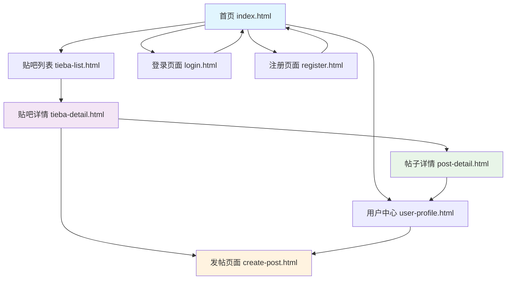

# 百度贴吧项目需求分析文档

## 1. 产品概述

本项目是一个基于Web的类百度贴吧社区平台，旨在为用户提供一个开放、互动的在线讨论社区。用户可以创建和加入不同主题的贴吧，发布帖子，参与讨论，建立社交关系。

- 解决问题：为用户提供一个按兴趣分类的在线讨论平台，促进知识分享和社交互动
- 目标用户：对特定话题感兴趣的网民，包括学生、专业人士、爱好者等
- 产品价值：构建活跃的在线社区生态，提升用户粘性和平台价值

## 2. 核心功能

### 2.1 用户角色

| 角色 | 注册方式 | 核心权限 |
|------|----------|----------|
| 游客用户 | 无需注册 | 浏览帖子、搜索贴吧 |
| 注册用户 | 邮箱/手机注册 | 发帖、评论、点赞、关注、收藏 |
| 贴吧管理员 | 系统指定 | 管理贴吧内容、设置贴吧规则 |
| 系统管理员 | 内部分配 | 全站管理、用户管理、数据统计 |

### 2.2 功能模块

本项目包含以下8个核心页面：

1. **首页 (index.html)**: 导航栏、轮播推荐、热门贴吧展示、热门帖子列表
2. **贴吧列表页 (tieba-list.html)**: 贴吧搜索、分类筛选、贴吧网格展示
3. **贴吧详情页 (tieba-detail.html)**: 贴吧信息、帖子列表、发帖入口
4. **帖子详情页 (post-detail.html)**: 帖子内容、评论系统、互动功能
5. **发帖页面 (create-post.html)**: 富文本编辑、图片上传、标签选择
6. **用户中心页 (user-profile.html)**: 个人信息、我的帖子、消息通知、设置
7. **登录页面 (login.html)**: 用户登录、密码找回
8. **注册页面 (register.html)**: 用户注册、邮箱验证

### 2.3 页面详情

| 页面名称 | 模块名称 | 功能描述 |
|----------|----------|----------|
| 首页 | 导航栏 | 显示logo、主菜单、用户登录状态、搜索框 |
| 首页 | 轮播区域 | 展示4张精选推荐内容，支持自动播放和手动切换 |
| 首页 | 热门贴吧 | 网格展示6个热门贴吧，包含头像、名称、成员数 |
| 首页 | 热门帖子 | 列表展示3个热门帖子，包含标题、作者、回复数 |
| 贴吧列表页 | 搜索筛选 | 提供搜索框、分类选择、排序方式选择 |
| 贴吧列表页 | 贴吧网格 | 展示8个贴吧卡片，包含关注按钮和统计信息 |
| 贴吧详情页 | 贴吧头部 | 显示贴吧头像、名称、描述、成员统计 |
| 贴吧详情页 | 帖子列表 | 表格形式展示帖子，支持标签筛选和分页 |
| 帖子详情页 | 帖子内容 | 展示完整帖子内容、图片、作者信息 |
| 帖子详情页 | 评论系统 | 支持评论发布、回复、点赞、嵌套显示 |
| 发帖页面 | 富文本编辑器 | 提供格式化工具、表情选择、图片上传 |
| 发帖页面 | 草稿功能 | 自动保存草稿、恢复未完成内容 |
| 用户中心 | 个人资料 | 头像上传、基本信息编辑、统计数据展示 |
| 用户中心 | 内容管理 | 我的帖子、收藏列表、消息通知 |
| 登录页面 | 用户认证 | 用户名/邮箱登录、密码验证、记住登录状态 |
| 注册页面 | 用户注册 | 表单验证、邮箱验证、用户协议确认 |

## 3. 核心流程

### 用户注册流程
1. 访问注册页面 → 填写注册信息 → 邮箱验证 → 注册成功 → 自动登录

### 用户发帖流程
1. 登录系统 → 选择贴吧 → 进入发帖页面 → 编辑内容 → 选择标签 → 发布帖子

### 用户互动流程
1. 浏览帖子 → 点击进入详情 → 阅读内容 → 点赞/评论/收藏 → 关注作者

### 页面导航流程图

## 4. 用户界面设计

### 4.1 设计风格

- **主色调**: #007AFF (iOS蓝色)，#5856D6 (紫色辅助)
- **按钮样式**: 圆角设计，8px小圆角，12px中圆角，16px大圆角
- **字体**: 系统默认字体栈，14px基础字号，16px标题字号
- **布局风格**: 卡片式设计，网格布局，顶部导航栏
- **图标风格**: 简洁线性图标，统一视觉语言

### 4.2 页面设计概览

| 页面名称 | 模块名称 | UI元素 |
|----------|----------|---------|
| 首页 | 轮播区域 | 玻璃态效果，渐变背景，圆角卡片，自动切换指示器 |
| 贴吧列表页 | 贴吧卡片 | 白色背景，阴影效果，悬停动画，关注按钮渐变 |
| 帖子详情页 | 评论区域 | 嵌套缩进，头像圆形，时间戳灰色，回复按钮蓝色 |
| 发帖页面 | 编辑器 | 工具栏固定，按钮组合，拖拽上传区域虚线边框 |
| 用户中心 | 标签页 | 下划线指示器，平滑过渡，激活状态蓝色高亮 |

### 4.3 响应式设计

- **桌面端优先**: 主要针对PC端用户设计
- **移动端适配**: 768px以下自动切换为移动布局
- **触摸优化**: 按钮最小44px点击区域，手势滑动支持

## 5. 非功能需求

### 5.1 性能要求
- 页面加载时间 < 3秒
- 图片懒加载优化
- CSS/JS文件压缩

### 5.2 兼容性要求
- 支持Chrome 80+、Firefox 75+、Safari 13+
- 移动端iOS 12+、Android 8+

### 5.3 安全要求
- XSS防护
- CSRF令牌验证
- 用户输入过滤和验证

### 5.4 可用性要求
- 界面直观易用
- 操作反馈及时
- 错误提示友好

## 6. 技术约束

- 前端技术：纯HTML5 + CSS3 + JavaScript ES6+
- 样式框架：自定义CSS变量系统
- 布局技术：Flexbox + CSS Grid
- 响应式：移动优先设计
- 浏览器兼容：现代浏览器支持
- 部署方式：静态文件部署

## 7. 项目里程碑

### 第一阶段：基础框架 ✅
- 完成8个核心页面HTML结构
- 建立统一的CSS样式系统
- 实现基础的页面导航

### 第二阶段：交互功能 ✅
- 实现轮播图自动播放
- 添加表单验证功能
- 完成富文本编辑器

### 第三阶段：用户体验优化 ✅
- 响应式布局适配
- 动画效果和过渡
- 草稿保存功能

### 第四阶段：文档完善 🔄
- 项目需求分析文档
- 技术架构设计文档
- 功能模块思维导图
- 页面调用关系图

## 8. 风险评估

### 技术风险
- 浏览器兼容性问题
- 性能优化挑战
- 安全漏洞风险

### 业务风险
- 用户需求变更
- 竞品功能对比
- 用户体验反馈

### 解决方案
- 渐进式增强开发
- 定期代码审查
- 用户测试反馈收集