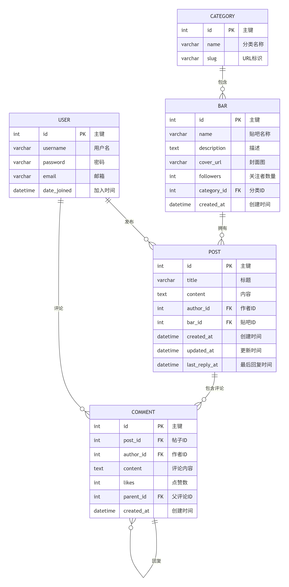
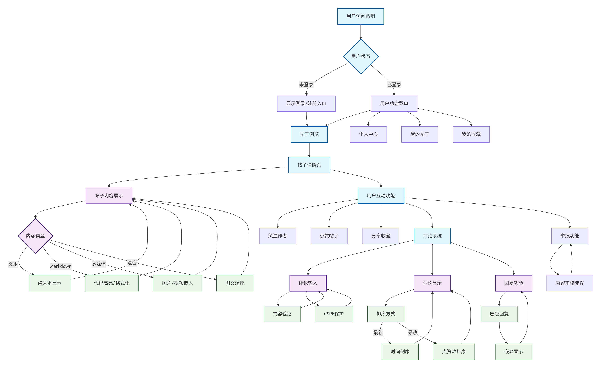

# 项目详细分析文档

## 1. 背景与目标
- 背景：参考百度贴吧的兴趣社区形态，构建可运行的轻量论坛系统，支持基本的发帖、回帖与吧管理。
- 目标：交付可预览的前端页面与可用的后端服务；完成核心用户与内容流转闭环；沉淀技术架构与数据模型以便后续扩展。
- 范围：覆盖首页、吧详情、帖详情、发帖、登录/注册；提供基础 API（分类、吧、帖子、注册）。

## 2. 现状综述
- 前端：静态 HTML/CSS 页面与 Django 模板并存，已具备首页两栏布局、吧列表与帖子列表、登录/注册页。
- 后端：Django 5.2.7 + DRF，路由清晰，模型完整；开发环境使用会话/基础认证；默认数据库为 SQLite。
- 预览与联调：静态预览 `http://127.0.0.1:8010/index.html`；后端开发服务 `http://127.0.0.1:8000/`。
- 静态导出：管理命令 `export_html` 将模板数据导出至 `tieba_backend/static_site/`，便于演示与提交。

## 3. 需求分析
### 3.1 功能需求（Must）
- 用户：注册、登录、退出、登录态访问发帖页。
- 贴吧：列表与详情页；按分类筛选；热门吧聚合。
- 帖子：列表与详情页；支持评论展示；发帖创建。
- 收藏：帖子收藏功能；我的收藏页面；取消收藏功能。
- 首页：热门吧与热门帖聚合展示；轮播与推荐区占位。

### 3.2 增强需求（Should）
- 评论楼中楼与点赞；帖子置顶/精华；吧成员与权限管理；搜索与热门推荐。
- 前端组件化（Vue/React/Veaury）与更丰富交互（排序、过滤、预览）。

### 3.3 非功能需求
- 安全：CSRF、防注入、鉴权与权限控制、HTTPS（生产）。
- 性能：列表分页、缓存（可用 Redis）、数据库索引。
- 可用性：容错与清晰错误提示；移动端适配；可访问性基础（语义标签）。
- 可维护性：清晰模块边界、代码与文档同步、自动化测试。

## 4. 技术架构与栈
- 架构：前端静态层 → 后端服务层（Django + DRF） → 数据层（SQLite/可切 MySQL）。
- 技术：`Django 5.2.7`、`DRF`、`corsheaders`、`HTML/CSS`；
- 认证：开发环境启用 `SessionAuthentication`/`BasicAuthentication`，生产可切换 `JWT + HTTPS`。
- 跨域：允许 `http://localhost:5173`、`http://127.0.0.1:5173` 前端联调。

## 5. 数据模型与关系
- Category(name, slug, created_at)：分类。
- Bar(name, description, cover_url, followers, category(FK), created_at)：贴吧。
- Post(title, content, author(FK User), bar(FK), created_at, updated_at, last_reply_at)：帖子。
- Comment(post(FK), author(FK), content, likes, parent(self FK, 可空), created_at)：评论。
- Favorite(user(FK User), post(FK), created_at)：收藏。
- 关系：Category 1-N Bar；Bar 1-N Post；Post 1-N Comment；User 1-N Post/Comment/Favorite；Post 1-N Favorite。

## 6. 路由与接口
- 页面路由（`forum/web_urls.py`）：
  - `/` → 首页 index
  - `/bars/<bar_id>/` → 吧详情 bar_detail（支持 `sort=new/hot`）
  - `/posts/<post_id>/` → 帖子详情 post_detail
  - `/posts/new/` → 发帖 create_post（登录态要求）
  - `/user/favorites/` → 我的收藏 user_favorites
  - `/login/`、`/logout/`、`/register/`
- API 路由（`forum/urls.py` + DRF Router）：
  - `/api/categories` → CategoryViewSet
  - `/api/bars` → BarViewSet
  - `/api/posts` → PostViewSet
  - `/api/register` → register

## 7. 关键流程
- 登录：账号密码验证 → 会话创建 → 返回首页或 `next`。
- 发帖：登录态校验 → 标题/内容/选择吧 → 创建 Post → 跳转吧详情。
- 收藏：帖子详情页点击收藏按钮 → AJAX请求 → 创建Favorite记录 → 按钮状态更新。
- 我的收藏：导航栏点击入口 → 加载用户收藏列表 → 展示收藏的帖子信息。
- 取消收藏：收藏列表页点击取消按钮 → AJAX请求 → 删除Favorite记录 → 列表动态更新。
- 首页聚合：热门吧（按关注与创建时间降序）与热门帖（按 `last_reply_at/updated_at/created_at` 降序）。
- 吧详情：列表排序（最新/最热），作者与最后回复时间信息展示。

## 8. 测试计划
- 单元测试：模型字段与关系、视图函数返回、权限与重定向逻辑。
- 集成测试：页面路由与模板渲染、API 端点的 CRUD 与鉴权。
- 手工回归：发帖流程、登录与注册、首页聚合与吧详情排序。
- 覆盖建议：核心路径（登录→发帖→吧详情→帖详情→评论）。

## 9. 部署与运维
- 开发：`python manage.py runserver 127.0.0.1:8000`；静态预览：`python -m http.server 8010`。
- 生产：Nginx 反代 + Django（gunicorn/uwsgi）；数据库切换 MySQL；开启 HTTPS 与安全头；接入日志与监控。
- 数据：迁移与种子脚本；定期备份；建索引与慢查询分析。

## 10. 风险与缓解
- 认证兼容：开发使用会话/基础认证，生产切 JWT；计划分支与逐步迁移。
- 跨域与前端联调：已允许 5173 端口；本地/生产域名需按环境配置。
- 文档与代码偏差：建立文档更新节奏（提测/发布节点强制更新）。
- 静态与模板混合：导出静态用于提交，但功能开发优先模板动态页；避免重复维护。

## 11. 里程碑与交付
- M1 原型完成：页面与基本路由打通，静态导出可用。
- M2 核心功能：发帖、评论、聚合展示稳定；登录/注册流畅。
- M3 增强功能：吧权限、帖子置顶/精华、搜索与推荐。
- M4 生产化：切换 MySQL、接入 Nginx/HTTPS、完善监控与告警。

## 12. 验收标准（示例）
- 可运行：本地启动后端与静态预览均无报错；核心页面可访问。
- 功能闭环：登录→发帖→吧详情/帖详情→评论流程可用。
- 数据一致：模型字段与关系符合文档；列表排序和聚合逻辑正确。
- 文档齐备：技术架构、项目说明、ER 图与导图呈现完整。

## 13. 附：功能导图（参考）

